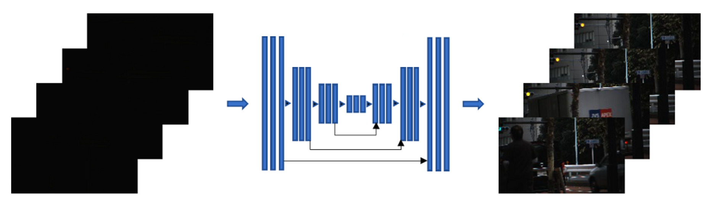
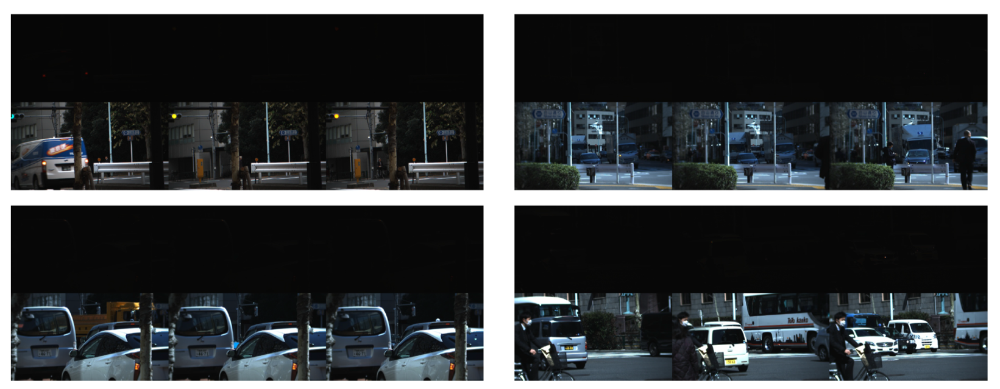
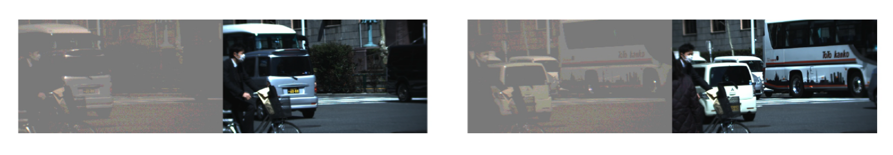
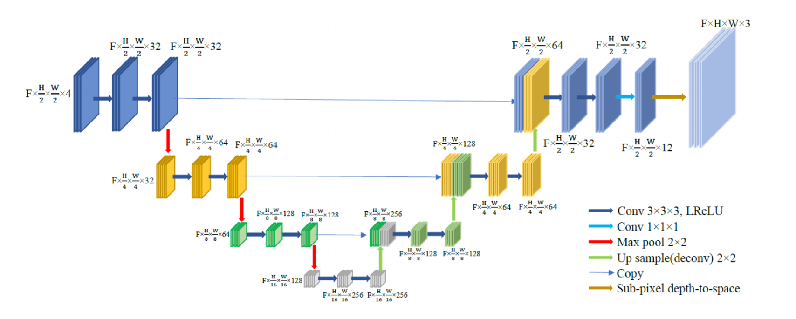
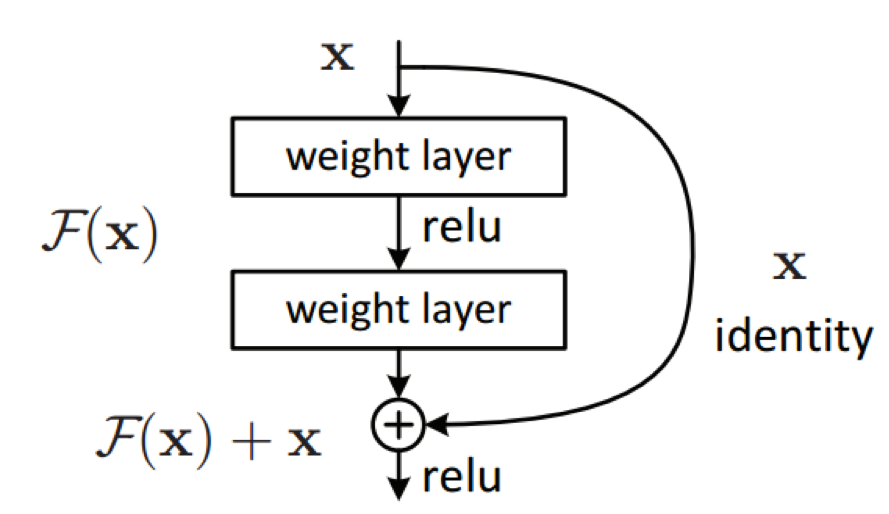
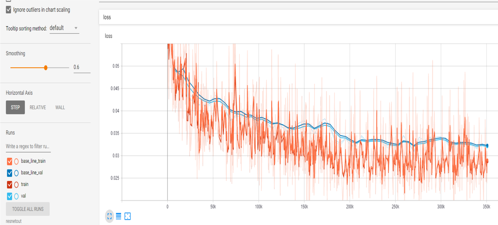
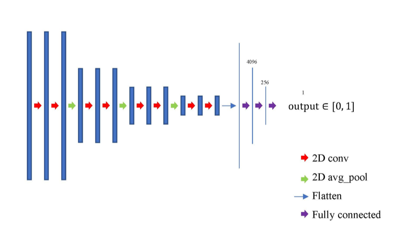

# Extreme Dark Video Enhancement

#### USC 2019 Fall CSCI 566 Course Project
#### Team Name : *Ocean's Five* 
This project is aimed to directly enhance extreme low light videos captured by ordinary cameras. This project is implemented by [Haiyang Jiang](https://github.com/MichaelHYJiang), [Boyuan Wang](https://github.com/wangby511), [Feng Chi](https://github.com/chifeng1113), [Yue Qin](https://github.com/qiny9492) and [Hongfa Huang](https://github.com/gordonxwong).

[Demo Video](https://youtu.be/XTlWN0xPwQE)

   * [Motivation](#motivation)
   * [Problem Descriptions and Dataset](#problem-descriptions-and-dataset)
   * [Approaches](#approaches)
      * [Approach 1: Batch Update](#approach1-add-batch-size)
      * [Approach 2: Multiple Loss Functions](#approach2-add-multi-loss)
      * [Approach 3: Residual Blocks](#approach3-resnet)
      * [Approach 4: GAN](#approach4-gan)
   * [Prerequisites](#prerequisites)
   * [Usage](#usage)
   * [References](#references)
   * [Author](#author)

## Motivation
The extreme dark video enhancements could be applied to many cases nowadays. Some documentaries shold be shooted without the artificial light in order not to interfere with the environment ,disturbing the animals, for examples. In addition, some video evidences presented to the court might be caught by a CCTV in a dark enviroment. Moreover, every one holding a smart phone has easy access to take videos. Our extreme dark video enhancements can help to reproduce the dark documentary videos in a high-quality visible version, to make the video evidences bright and clear without missing the important details ,and to let video shooting ametaurs not worry too much about controlling the light in their shooting environments.

However,current solutions to such problem mainly involve near-infrared (NIR) LED or diodes. They help to gain better vision in low-light environments but also introduce drawbacks compared to natural light cameras. Besides, the inevitable energy consumption and heat generation with the presence of extra light sources can increase operation and maintenance costs of a system. More significantly, visible color and texture information could suffer from extensive loss by using such system. Thus, we want to train a dark vedio enhancement network which can dramatically save the maintenance cost and ensure our vedio qualities.




## Problem Descriptions and Dataset
Our dataset includes 179 video pairs of street views with moving vehicles and pedestrians under different conditions. Each video pair is of 200 frames taken by a beam splitter. It feeds light into two cameras concurrently and one of them is equipped with a neutral density filter. In this way, we obtain perfect match videos with just light illumination differences. The input format is raw sensor data with Bayer filters to ensure sufficient information against noise level under low light environments. The input, dark videos are chronologically organized raw images. The output, bright videos are in sRGB space, encoded in mp4 format for the convenience of visualizing and post-processing.

A subset of key frames are shown in following figure. Videos in our dataset are down-sampled with a factor of 3 on width and height (i.e. 1/9 of original size), in order to save training and testing time. Sizes of down-sampled
9 frames are around 340 × 620 pixels. All raw data have been packed and stored in numpy arrays for fast read-in and convenience of processing.



We also provide a comparison between input frames and their corresponding ground truth frames in Figure 4, to illustrate pixel-level alignment between training input and ground truth. It can be seen from the figure that there are challenges of low contrast, high noise level, and unnatural color mapping in our task. Alignment between frames in input videos (left) and ground truth videos (right). Frames of input videos are linearly scaled to provide more details of objects and noise level.



| | Number of video pairs | Number of Frames |
| --- | --- | --- |
| Training | 125 | 200 |
| Validation | 27 | 200 |
| Test | 27 | 200 |

## Approaches

We use U-Net model as the basic network in our project. The U-Net is originally used for segmentation of images in medical and biomedical fields by using convolutional networks with upsampling functions. For the type of our input data is video, we modify the dimensions of input to the network from 2D to 3D. Hence, we use a 3D-Convolution and 2D-Pooling U-Net and we also control the depth of U-Net between two and four, typically in three. The following figure illustrates the details about our network structure.



During the training approach, we cut the video data into pieces with cropping and flipping action before feeding it into the network. For example, we select piece of 16 × 256 × 256. In this piece, 16 represents number of frames and 256 represents both height and width. After the training step, we saved the trained model into a file. During the test phase, we load the model again and use it to transfer the new video data to a new generated video by cutting it into pieces just like the size in the training approach. Then we send them into the network and concatenate the output pieces together with a bit overlapping.

Currently, we are using Adam optimizer and L1 loss between generated videos and ground truth to train the model. This is defined as our Baseline Approach.

In addition to the Baseline model, we also use Histogram Equalization, add GAN, ResNet as well as function of multi losses and update hyper parameters to optimize the current algorithm as well as improving experiment different metrics.

### Approach1 Add Batch Size

**Results** 

| | Final Loss | Final Validation Loss | PSNR | SSIM | MSE (MABD) Unit: 10^-3 |
| --- | --- | --- | --- | --- | --- |
| 1 (baseline) | 0.039408 | 0.044127 | 24.753451|0.788749|2.945|
| 10 | 0.248571 | 0.216568 | 12.412363 | 0.425483 | 8.007|

**Conclusions** 
* Use batch size > 1 can speed up the training process. (batch size = 10 is 2 times faster than baseline)
* When batch size is large, it uses more memory to train. In this case, I choose 4 CPU 15GB memory for the virtual machine, it cannot handle batch size > 20.
* Batch size causes the loss, PSNR, SSIM etc. to converge slower than baseline, if we use the same epoch.

### Approach2 Add Multi Loss

1. **L1-Loss**. This loss is used in baseline. It computes average absolute difference for each pixel.

2. **Regional-Loss**. It is the same as L1-Loss but we separate dark and bright regions and set different weights for them two, normally 4:1. Usually we set the threshold as 0.7 to separarte dark and bright regions in (0,1) range type.

3. **Structure-Loss**. The SSIM is a very standard method means structural similarity index with its value in range (-1,1). We use the gap between it and 1 as the structure loss.

4. **VGG-Loss**. We use both the generated image and its corresponding output image to send into pretrained VGG19 network model and get their L1-Loss from convolution layers from 1 to 4 as sum of losses together.

**Results** 

| | Final Loss | Final Validation Loss | PSNR | SSIM | MSE (MABD) Unit: 10^-3 |
| --- | --- | --- | --- | --- | --- |
| L1 Loss (baseline) | 0.02962 | 0.03367 | 27.26798 | 0.84049 | 0.18188 |
| Structure Loss | 0.18124 | 0.20149 | 26.70764 | 0.85367↑ | 1.5242 |
| Region Loss | 0.15896 | 0.17681 |27.23463 | 0.84026 | 0.48029 |
|VGG Loss (Add vgg19) | 139.36647 | 150.83625 | 27.02222 | 0.83217 | 0.1627↓|
|Multi Loss1 (Str Reg VGG) |1.75286 |1.91280 | 27.22877 | 0.84750 | 0.37438|
|Multi Loss2 (L1 Str Reg) | 0.35868 | 0.40669 | 27.06469 | 0.852218↑ | 2.392 | 

**Conclusions** 
* Compared to L1-Loss as baseline, using structure loss may help improve SSIM(structural similarity index), which means the better relationship of one pixel to its neighbors.
* Using higher conv layer outputs difference of VGG network as loss does not help improve the result.
* Using the combination loss of L1 loss, Regional loss and Structure loss for training can improve both MABD and SSIM.

### Approach3 ResNet

Deep Neural Networks usually face the degradation problem. In this approach we add a residual to the previous value to each block of layers rather than produce an entirely new value. It is easy to represent the identity function. We replace our convolution blocks in Unet with residual blocks and add 1x1x1 convolution projection on input to match dimension.



**Results** 

||Final Loss | Final Validation Loss | PSNR | SSIM | MSE (MABD) Unit: 10^-3|
| --- | --- | --- | --- | --- | --- |
|Baseline | 0.0292539 | 0.03194653 | 27.203414 | 0.8399437 | 0.727619 |
|ResNet | 0.02898007 | 0.03173088 | 27.4375552 | 0.841417162 | 0.18700 |



### Approach4 GAN



**Results** 

||Final Loss | Final Validation Loss | PSNR | SSIM | MSE (MABD) Unit: 10^-3 |
| --- | --- | --- | --- | --- | --- |
|Without GAN | 0.02925 | 0.03195 | 27.20341 | 0.83994 | 0.72762 |
|With GAN | 0.02907 | 0.03209 | 27.38365 | 0.84086 | 0.14062 | 

## Prerequisites

- [Python 2.7](https://www.python.org/download/releases/2.7/)
- [Tensorflow 1.1.14](https://www.tensorflow.org/versions/r1.14/api_docs/python/tf)
- [NumPy](http://www.numpy.org/)
- [scikit-video](http://www.scikit-video.org/stable/io.html)
- [OpenCV2](https://pypi.org/project/opencv-python/)

## Usage

Download dataset from Google Cloud first.
Put it in *0_data* directory and unzip it.

#### Generate file lists
```Shell
python generate_file_list.py
```

#### Training
```Shell
python train.py
```

#### Testing
```Shell
python test.py [test_case]
```
test_case can be:

0   test on training set

1   test on validation set

2   test on test set(save npy results)

3   test on customized set

All cases save mp4 output videos, while case 2 saves extra npy results.

## References
[1] [Learning to See in the Dark](https://arxiv.org/pdf/1805.01934.pdf). Chen Chen, Qifeng Chen, Jia Xu and Vladlen Koltun. The IEEE Conference on Computer Vision and Pattern Recognition (CVPR), 2018.

[2] [MBLLEN: Low-Light Image/Video Enhancement Using CNNs](http://bmvc2018.org/contents/papers/0700.pdf). Feifan Lv, Feng Lu, Jianhua Wu, and Chongsoon Lim. In British Machine Vision Conference 2018, BMVC 2018, Northumbria University, Newcastle, UK, September 3-6, 2018, page 220. BMVA Press, 2018.

[3] [Learning to See Moving Objects in the Dark](http://openaccess.thecvf.com/content_ICCV_2019/papers/Jiang_Learning_to_See_Moving_Objects_in_the_Dark_ICCV_2019_paper.pdf). Haiyang Jiang and Yinqiang Zheng.  Learning to see moving objects in the dark.  The IEEE International Conference on Computer Vision (ICCV), October 2019.

## Author
**Ocean's Five**
* [Haiyang Jiang](https://github.com/MichaelHYJiang), haiyangj@usc.edu
* [Boyuan Wang](https://github.com/wangby511), boyuanwa@usc.edu
* [Feng Chi](https://github.com/chifeng1113), chi721@usc.edu
* [Yue Qin](https://github.com/qiny9492), qiny@usc.edu
* [Hongfa Huang](https://github.com/gordonxwong),hongfahu@usc.edu
